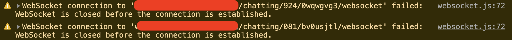
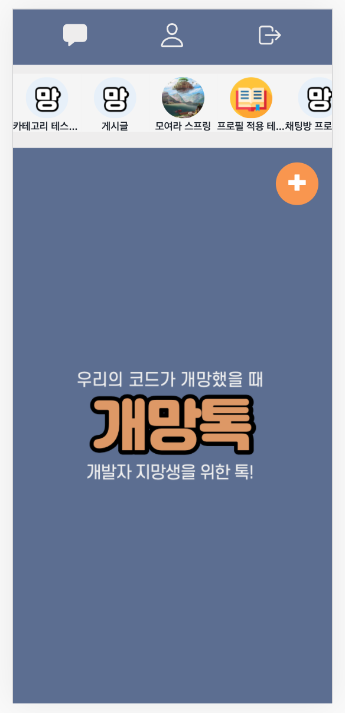
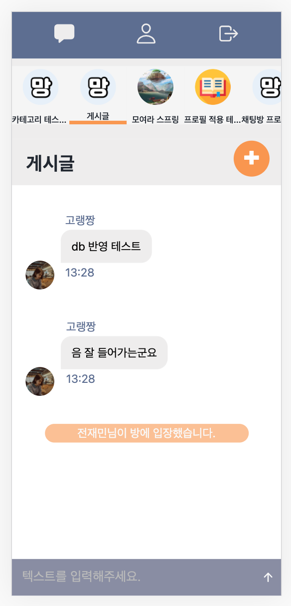
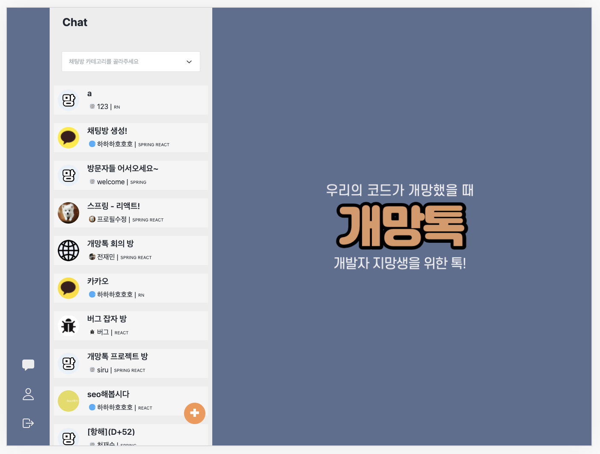
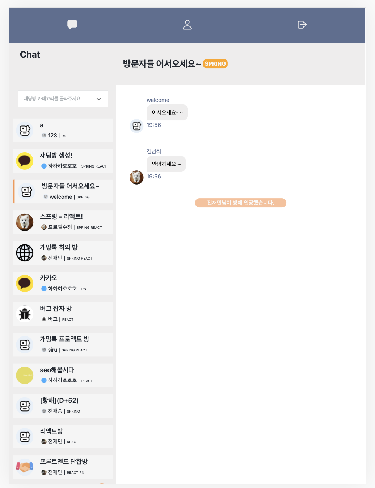

# gaemangtalk_frontend


😊[사이트 링크](http://gaemangtalk.site/)

🎬 [유튜브 링크](https://youtu.be/MDPGmLslJbg)

📁 [백엔드 Repositroy 링크](https://github.com/joychae/Springboot-Webproject-ChatService)

**gaemangtalk 프로젝트의 프론트 엔드 Repositroy 입니다.**

## 목차

[1. 개요](#개요)

[2. 프로젝트 특징](#프로젝트-특징)

[3. 기능 상세 소개](#기능-상세-소개)

[4. 상세페이지](#상세페이지)

[5. 사용 패키지](#사용-패키지)

[6. Trouble shooting](#Trouble-shooting)

[7. 개발 타임라인](#개발-타임라인)

[8. Contents](#Contents)

[9. License](#License)

[10. Reference](#Reference)

## 개요

- 명칭 : gaemangtalk
- 개발 인원 : 4명
- 개발 기간 : 2021.04.16 ~ 2021.04.22
- 주요 기능 : 소셜 로그인, 채팅
- 개발 언어 : JavaScript
- 개발 라이브러리 : React.js
- 형상 관리 툴 : git
- 협업 툴 : Slack,[notion](https://www.notion.so/9588991f3b544637a65490d3111a1592?v=f55c1d5304df47d79a184d20c23b3539)
- 간단 소개 : 리액트 - 스프링 협업의 웹소켓 기반 채팅 프로젝트

## 프로젝트 특징

- 개.망.톡!
  - 개발자 지망생을 위한 톡
- 프론트엔드와 백엔드를 분리하여 프로젝트 개발
  - 각 파트별로 Repository를 생성 후 작업
  - 프론트: AWS S3
  - 백엔드: AWS EC2
  - 빌드 후, S3와 EC2를 연동
    - API 명세서에 따라 API호출 및 응답 확인
- React, Spring을 기반으로한 채팅 웹 애플리케이션
- 개발 공부를 하면서 고민, 잡담을 할수 있는 채팅 서비스
- 일반 회원가입 및 소셜 로그인(카카오) 연동
  - Validation
  - JWT, 쿠키 방식
- 카테고리(태그), 채팅방 이미지 설정을 하여 방 생성
- 카테고리(태그)별 조회기능
- 회원정보탭에서 사용자 정보 수정
  - 닉네임, 프로필 사진
- websocket 기반의 채팅 기능
  - sockjs-client, stompjs
- 사용자의 메시지와 상대방의 메시지를 구분하는 ui 적용
- 반응형 디자인
  - 태블릿, 스마트폰

## 기능 상세 소개

### 1. WebSocket

- HTTP는 실시간 통신이 불가능
- WebSocket은 실시간 통신의 문제를 해결
- 실시간 양방향 통신을 지원
- 핸드쉐이크(HTTP) -> 양방향 통신

### 2. Stomp

- Simple Text Oriented Messaging Protocol
- 텍스트 기반의 프로토콜
- `connect`, `subscribe`, `send`, `disconnect`, `usubscribe` 메소드
  - `connect` -> `subscribe` 이후 별도의 요청 없이 서버로부터 데이터를 받을 수 있는 상태가 된다.
  - 이 때, `send`메소드로 데이터를 전송할 수 있다.
  - `send`로 메시지를 보내면 `subscribe`상태이므로 자동으로 자신의 메시지도 표시된다.
  - 연결을 해제할 때, `disconnect`, `unsubscribe` 를 한다.

#### 적용 코드

```JavaScript
// styled-components, import, export, retrun은 생략
// 채팅 방 컴포넌트
const ChattingRoom = (props) => {
 // 소켓 통신 객체
 const sock = new SockJS('엔드포인트');
 const ws = Stomp.over(sock);

 // 방 제목 가져오기
 const { roomName, category } = useSelector((state) => state.chat.currentChat);
 const roomId = useSelector((state) => state.chat.currentChat.roomId);

 // 토큰
 const token = getCookie('access-token');
 const dispatch = useDispatch();

 // 보낼 메시지 텍스트
 const messageText = useSelector((state) => state.chat.messageText);
 // sedner 정보 가져오기
 let sender = useSelector((state) => state.user.userInfo?.username);
 if (!sender) {
   sender = getCookie('username');
 }

 // 렌더링 될 때마다 연결,구독 다른 방으로 옮길 때 연결, 구독 해제
 React.useEffect(() => {
   wsConnectSubscribe();
   return () => {
     wsDisConnectUnsubscribe();
   };
 }, [roomId]);

 // 웹소켓 연결, 구독
 function wsConnectSubscribe() {
   try {
     ws.connect(
       {
         token: token
       },
       () => {
         ws.subscribe(
           `/sub/api/chat/rooms/${roomId}`,
           (data) => {
             const newMessage = JSON.parse(data.body);
             dispatch(chatActions.getMessages(newMessage));
           },
           { token: token }
         );
       }
     );
   } catch (error) {
     console.log(error);
   }
 }

 // 연결해제, 구독해제
 function wsDisConnectUnsubscribe() {
   try {
     ws.disconnect(
       () => {
         ws.unsubscribe('sub-0');
       },
       { token: token }
     );
   } catch (error) {
     console.log(error);
   }
 }

 // 웹소켓이 연결될 때 까지 실행하는 함수
 function waitForConnection(ws, callback) {
   setTimeout(
     function () {
       // 연결되었을 때 콜백함수 실행
       if (ws.ws.readyState === 1) {
         callback();
         // 연결이 안 되었으면 재호출
       } else {
         waitForConnection(ws, callback);
       }
     },
     1 // 밀리초 간격으로 실행
   );
 }

 // 메시지 보내기
 function sendMessage() {
   try {
     // token이 없으면 로그인 페이지로 이동
     if (!token) {
       alert('토큰이 없습니다. 다시 로그인 해주세요.');
       history.replace('/');
     }
     // send할 데이터
     const data = {
       type: 'TALK',
       roomId: roomId,
       sender: sender,
       message: messageText,
     };
     // 빈문자열이면 리턴
     if (messageText === '') {
       return;
     }
     // 로딩 중
     dispatch(chatActions.isLoading());
     waitForConnection(ws, function () {
       ws.send(
         '/pub/api/chat/message',
         { token: token },
         JSON.stringify(data)
       );
       console.log(ws.ws.readyState);
       dispatch(chatActions.writeMessage(''));
     });
   } catch (error) {
     console.log(error);
     console.log(ws.ws.readyState);
   }
 }

```

## 상세페이지

### 로그인, 카카오 소셜 로그인


### 회원가입


- validation은 마켓컬리 스타일 적용

### 비밀번호 찾기 기능


### 회원정보 수정


### 채팅방 생성✨


### 채팅✨


### 반응형 - 모바일 / 태블릿


## 사용 패키지

- **class101/ui**
  - 리액트와 연동되는 ui 패키지
- **reduxjs/toolkit**
  - 데이터 전역 관리를 위한 리덕스 관리 패키지
- **socks-client**
  - 웹 소켓 통신을 가능하게 하는 라이브러리
- **stompjs**
  - 메시지 프로토콜
- **styled-components**
  - 컴포넌트의 스타일을 설정하는 패키지
- **axios**
  - 서버 통신을 위한 패키지
- **connected-react-router, history**
  - 라우팅 및 페이지 이동을 위한 패키지

## Trouble shooting

**프로젝트를 하며 마주친 문제들과 해결한 방법을 정리**

### 1. withcredential?

- withCredential은 옵션이 true면 다른 포트끼리 쿠키 공유가 가능하다
- 기본값은 false
- 이전 프로젝트에서 withCredential=true로 하지않으면 cors에러가 나서 옵션을 미리 바꾸고 api 요청을 했는데, 아래와 같은 에러가 났다
  `Access to XMLHttpRequest at 'http://54.180.141.91:8080/api/user/signup/emailCheck' from origin 'http://localhost:3000' has been blocked by CORS policy: Response to preflight request doesn't pass access control check: The value of the 'Access-Control-Allow-Origin' header in the response must not be the wildcard '*' when the request's credentials mode is 'include'. The credentials mode of requests initiated by the XMLHttpRequest is controlled by the withCredentials attribute.`
- response header의 'Access-Control-Allow-Origin'가 \*면 withCredential이 true면 안되는 의미.
- 지금 서버설정에서는 withCredential을 다시 false로 바꾸니 요청이 잘 들어갔다

### 2. 로그인 유지할 때 어떻게 하지?

- 새로고침하면 스토어에 저장한 user 정보가 사라져서, 로그인 상태를 유지할 방법이 필요하다.
- 로그인할 때 필요한 사용자 정보를 쿠키나 세션 스토리지에 저장할지, 토큰만 저장해 토큰으로 user 정보를 가져올지 고민했음
- 사용자 정보를 스토리지에 저장하면, 업데이트를 할 때도 매번 반영을 해야해서, token 값만 저장해 새로고침할 때마다 user 정보를 오는 방법으로 구현했다.
- 쿠키는 요청이 갈 때마다 같이 전송이 되므로, 브라우저를 끄면 정보가 사라지는 session에 토큰을 저장하는 방법이 좋을 것 같다

### 3. 채팅이 끊기는 문제



- Connect -> Subscribe 후 send 메소드로 메시지를 보낼 때 발생
- 접속 자체가 되어있음에도 불구하고 간헐적으로 발생

#### 원인

- 웹소켓 객체의 readyState라는 프로퍼티의 상태
- send 메소드를 보낼 때, readyState가 0이면 위의 오류가 발생하는 것이었음

| Value | State      | Description                                |
| ----- | ---------- | ------------------------------------------ |
| 0     | CONNECTING | 소켓이 생성, 연결이 아직 되지 않음         |
| 1     | OPEN       | 연결이 열려 있고 , 통신할 준비가 되어 있음 |

#### 해결

- setTimeout 함수로 readyState가 1이 될 때 send 메소드를 실행할 수 있도록 함

```JavaScript
  // 웹소켓이 연결될 때 까지 실행하는 함수
  function waitForConnection(ws, callback) {
    setTimeout(
      function () {
        // 연결되었을 때 콜백함수 실행
        if (ws.ws.readyState === 1) {
          callback();
          // 연결이 안 되었으면 재호출
        } else {
          waitForConnection(ws, callback);
        }
      },
      1 // 밀리초 간격으로 실행
    );
  }
```

<hr/>

**reference**

- https://developer.mozilla.org/ko/docs/Web/API/WebSocket/readyState

## 개발 타임라인

| 일자       | 진행 목록                                                                                                                                                                                                      |
| ---------- | -------------------------------------------------------------------------------------------------------------------------------------------------------------------------------------------------------------- |
| 2021.04.09 | 주제 선정<br />와이어프레임<br />API 설계<br />중간 점검 목표 설정                                                                                                                                             |
| 2021.04.10 | Repository 생성<br />뷰 만들기 계획<br />패키지 기본 세팅 계획<br />로고 제작<br />테마 색상 설정<br />색상표 설정<br />회원가입, 로그인 시스템 계획                                                           |
| 2021.04.12 | 회원가입, 로그인, 레이아웃, 최소단위 컴포넌트, 채팅 뷰<br />패키지 세팅<br />디렉토리 세팅<br />css reset<br />component theme 세팅<br />useInput Hook 세팅<br />회원가입 api<br />회원가입, 로그인 Validation |
| 2021.04.13 | 팝업창 구현<br />채팅방 생성, 조회 api<br />채팅 관련 리덕스 모듈 생성<br />Header 아이콘<br />faviconi 및 메타태그 설정<br />회원가입 페이지 완료<br />메시지 작성 input<br />웹소켓 토큰 보내기 확인         |
| 2021.04.14 | 웹소켓 서버와 연동<br />비밀번호 찾기 컴포넌트 생성<br />비밀번호 찾기 api<br />로그인 유지 기능                                                                                                               |
| 2021.04.15 | 메시지 화면 구현<br />소셜 로그인(카카오 로그인) <br />disconnect, unsubscribe 추가                                                                                                                            |
| 2021.04.16 | DB에서 메시지 가져오기(api)<br />엔터키 입력 기능, 메시지 시간 표시<br />채팅방 자동 스크롤<br />소셜 로그인(카카오 로그인) 구현 완료<br />메시지 카카오톡 로그인 사용자와 연동<br />axios 모듈화              |
| 2021.04.17 | 카카오 로그인 관련 리덕스 설정<br />채팅방 선택 효과 추가<br />메시지 컴포넌트 스타일 조정                                                                                                                     |
| 2021.04.18 | 프로필 이미지를 적용하기 위한 스타일 초안 적용<br />헤더 menu를 관리하기 위한 리덕스 생성<br />헤더 로그인/비로그인 활성화 기능<br />업로드 컴포넌트 생성                                                      |
| 2021.04.19 | 기본 프로필 이미지 설정<br />웹소켓 readyState 문제 해결<br />Message.js 스타일 설정<br />서버 ip 변경<br />유저 프로필 페이지 스타일링                                                                        |
| 2021.04.20 | 업로드 api 추가<br />채팅방 리스트 사진 적용, 뷰 적용<br />반응형 디자인 적용<br />가로모드 감지<br />카테고리(태그) 설정 기능, api<br />카테고리(태그) 별 조회 기능, api                                      |
| 2021.04.21 | 뷰 조정 및 사용성 개선<br />로그인 기능 수정<br />사용성 테스트 및 버그 개선<br />README.md 작성                                                                                                               |

## Contetnts

### 반응형 디자인(스마트폰)





### 반응형 디자인 (태블릿)





## License

### MIT

## Reference

- 로고제작
  - [미리 캔버스](https://www.miricanvas.com)